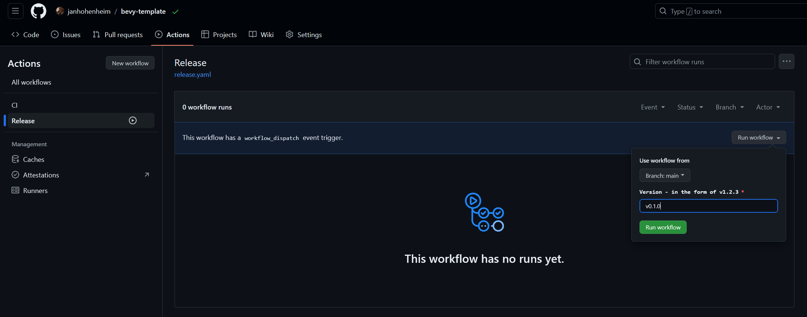
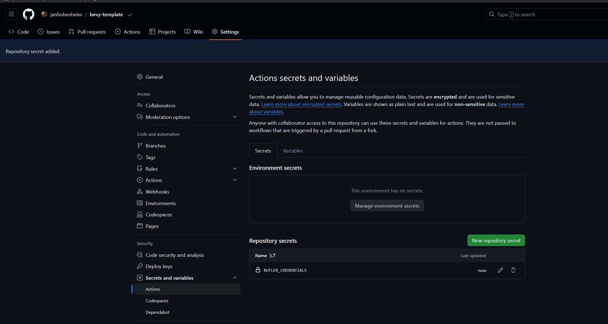

# Workflows

This template uses [GitHub workflows](https://docs.github.com/en/actions/using-workflows) for [CI / CD](https://www.redhat.com/en/topics/devops/what-is-ci-cd).
They are defined in [`.github/workflows/`](../.github/workflows).

## CI (testing)

The [CI workflow](.github/workflows/ci.yaml) will trigger on every commit or PR to `main`, and does the following.

- Run tests.
- Run Clippy lints.
- Check formatting.
- Check documentation.

> [!Tip]
> You may want to set up a [GitHub ruleset](https://docs.github.com/en/repositories/configuring-branches-and-merges-in-your-repository/managing-rulesets/about-rulesets) to require that all commits to `main` pass CI.
> <details>
> <summary>This picture shows how such a setup would look like</summary>
> 
> </details>

## CD (releasing)

The [CD workflow](../.github/workflows/release.yaml) will trigger on every pushed tag in the format `v1.2.3`, and:

- Create a release build for Windows, macOS, Linux, and web.
- (Optional) Upload to [GitHub releases](https://docs.github.com/en/repositories/releasing-projects-on-github).
- (Optional) Upload to [itch.io](https://itch.io).

<details>
  <summary>This workflow can also be triggered manually.</summary>

In your GitHub repository, navigate to `Actions > Release > Run workflow`:



Enter a version number in the format `v1.2.3`, then hit the green `Run workflow` button.
</details>

> [!Important]
> Using this workflow requires some setup. We will go through this now.

### Set up variables

[`.github/workflows/release.yaml`](../.github/workflows/release.yaml) contains a list of environment variables that are set automatically by `cargo generate`.
Otherwise, you will have to fill them in manually and push a commit.

<details>
<summary>Environment variables section of the release workflow</summary>

```yaml
env:
  # The base filename of the binary produced by `cargo build`.
  BINARY: bevy_template
  # The name to use for the packaged application produced by this workflow.
  PACKAGE_NAME: bevy-template
  # The itch.io page to upload to, in the format: `user-name/project-name`.
  # Comment this out to disable.
  ITCH_TARGET: the-bevy-flock/bevy-template
  # The organization or author that owns the rights to the game.
  OWNER: the-bevy-flock
  # The path to the assets directory.
  ASSETS_DIR: assets
  # Whether packages produced by this workflow should be uploaded to the Github release.
  UPLOAD_PACKAGES_TO_GITHUB_RELEASE: true
  # Before enabling LFS, please take a look at GitHub's documentation for costs and quota limits:
  # https://docs.github.com/en/repositories/working-with-files/managing-large-files/about-storage-and-bandwidth-usage
  USE_GIT_LFS: false
```

</details>

In any case, make note of the value used for `ITCH_TARGET`, as you will need it later.

### Set up permissions

In your GitHub repository, navigate to `Settings > Actions > General`:


Set `Workflow permissions` to `Read and write permissions`, then hit `Save`:


### Set up itch.io upload

Create your itch.io page with the same name as is used in the `ITCH_TARGET` variable in [release.yaml](../.github/workflows/release.yaml).
By default, this is the same as the project name.

In your GitHub repository, navigate to `Settings > Secrets and variables > Actions`:



Hit `New repository secret` and enter the following, then hit `Add secret`:

- **Name:** `BUTLER_CREDENTIALS`
- **Secret:** Your [itch.io API key](https://itch.io/user/settings/api-keys) (create a new one if necessary)
